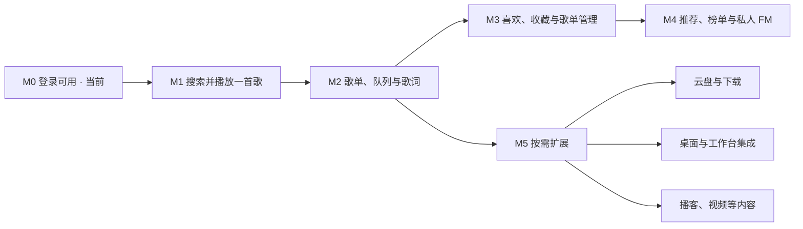

# 网易云音乐插件能力路线图

> 对象：`myavalonia-music-netease` / `myavalonia.plugin.music.netease`。
> 更新日期：2026-09-23。登录基线：`c469f91`；V2 实施依据：`cb061f3`，当前事实见[本轮记录](../archive/records/netease-v2/m1-implementation-20260923.md)。
> 起点：用户已确认登录没有问题，后续以登录可用为前提推进音乐能力。
> 状态：M1 核心实现与自动/联网解码已完成，真实听感和 Host/Dock 验收待完成；M2 功能与完整 V4 自动门禁已完成，实机验收仍待完成；M3–M5 尚未实施。里程碑编号不代表插件版本或交付日期。
> M1 专项：[V2 搜索与单曲播放实施方案](netease-v2-m1-playback-plan.md)与[专用开发验证矩阵](../maintenance/netease-v2-m1-playback-verification.md)已编写，实施状态由专项方案跟踪。
> 当前界面优化：[V3：Document / Tool 紧凑桌面界面改造](netease-v3-desktop-ui-and-theme-plan.md)已实现已有 M1 的现代紧凑布局、双色主题及轻量动效；真实 Host/缩放/性能验收由 V3 专项矩阵承接，不代表 M2 能力已经实现。
> M2 专项：[V4：日常播放器实施指导](netease-v4-m2-daily-player-plan.md)与[专用开发验证矩阵](../maintenance/netease-v4-m2-daily-player-verification.md)落实 SOLID 分工、队列与生命周期迁移及本地门禁。V4.0–V4.5 功能与 V4.6 自动收口完成，阶段证据见[V4 专用记录](../archive/records/netease-v4/m2-implementation-20260923.md)。

**建议主线：登录可用 → 搜歌并播放一首 → 歌单连续播放与歌词 → 管理自己的音乐 → 推荐发现。**

首个目标是让用户在插件里搜索歌曲、点击播放、听到声音并能暂停。随后完善日常听歌，再增加收藏、推荐等能力。云盘、下载、视频、社交按独立需求选择，不以移植全部上游模块为目标。

本文承接 [V1 登录计划](../archive/plans/netease-v1-flurl-login-plan.md)中的 P4–P5，将其展开为可逐项验收的能力路线。上游接口范围继续由[能力清单](../reference/netease-api-enhanced-capabilities.md)维护，已实现协议以[HTTP 与会话契约](../reference/netease-http-session.md)为准。

## 1. 现在站在哪里

### 1.1 已有能力与实际缺口

| 能力层 | 当前事实 | 后续可以利用什么 / 还缺什么 |
| --- | --- | --- |
| 登录入口 | 默认微信扫码，保留网易云 App 扫码；具备等待、确认、取消、过期和错误反馈 | 登录作为现成入口，不重新开发登录流程 |
| 账号与会话 | 账号核验、DPAPI、恢复、重试保存、退出；音乐使用带账号代次和凭据版本的受控快照 | 界面不读取 Cookie，音乐更新复用唯一会话提交者 |
| 真实验证 | 微信授权、网易回调和账号核验已有成功记录；本次用户确认登录可用 | 历史记录中恢复、远端退出、Host 验证仍有未覆盖项，随下一阶段联调补记，不作为重新开启登录开发的理由 |
| 网络与协议 | C# + Flurl，eapi/weapi/xeapi、请求级凭据、取消和限额 | 固定上游向量与真实音乐链已验证；新端点按独立需求扩展 |
| 音乐数据 | 搜索、详情、封面、歌单及曲目、逐行/翻译/逐字歌词、standard 资源与试听标记 | 收藏/歌单写入留给 M3，发现入口留给 M4 |
| 本地播放 | 共享队列、四模式、连续播放、进度定位、有限恢复、本机历史与按账号静默恢复 | 原生定位/恢复及三曲解码通过，真实连续听感和 Host 待验收；设备选择尚未实施 |
| 页面与宿主 | 音乐 Document 与账号/LibVLC 设置 Tool；Standalone 复用模型和 View | Headless 重挂通过，真实 Host/Dock 与双插件共存仍待验证 |
| 工作台与自动化 | 当前没有 Workbench Command 或 Workflow Action 注册 | 稳定播放语义形成后再考虑接入，模板说明不代表已有能力 |

源码依据见第 8 节。自动测试的历史通过记录仅证明其覆盖的行为，不能代替真实音频播放或 Host 联调。

### 1.2 能力承诺到哪里

- **上游模块是实现参考。** 现有清单统计固定提交下的 440 个 JavaScript 模块，包含包装和工具，不等于插件具备 440 项功能。
- **歌曲信息、播放地址和实际播放分别验收。** 搜索有结果、详情有音质字段，都不能直接标记“可完整播放”。地址和试听范围以当次远端结果为准；未知原因显示“暂不可播放”，不猜测具体权限原因。
- **引擎跨平台，内置库优先，也可指定共享目录。** V2 使用 LibVLCSharp + LibVLC，控件与执行由插件承载，原生库不强制自带；账号设置 Tool 提供路径配置。当前先验收 Windows x64，Linux/macOS 仍需目录加载、受保护存储及 Host 适配，详见 V2 第 3.3–3.4 节。
- **沿用 C# + Flurl 的接入方式。** 业务 HTTP、媒体下载和缓冲保持明确所有权；音频引擎选择必须验证实际取流方式。
- **实现和验收分开记录。** M1 当前契约见[播放说明](../reference/netease-music-playback.md)，尚未完成的真实验收保持未勾选；后续里程碑仍是计划。

## 2. 能力路线总览

| 里程碑 | 用户得到的能力 | 依赖与优先级 | 完成标志 |
| --- | --- | --- | --- |
| M0：登录可用 | 连接网易账号，查看与管理登录状态 | 已有基线 | 沿用当前成果 |
| M1：首个播放闭环 | 搜歌、查看基本信息、播放/暂停/停止、调节音量 | 最高优先级；依赖 M0，先验证播放协议与引擎 | 真实可播歌曲从搜索结果到扬声器完整走通 |
| M2：日常听歌 | 我的歌单、曲目列表、连续播放、队列、进度拖动、歌词、本地最近播放 | 依赖 M1；主线必做 | 能从自己的歌单持续听歌，切歌与页面切换行为稳定 |
| M3：音乐库管理 | 喜欢、收藏歌单、创建与编辑自有歌单 | 依赖 M2；主线后续 | 写入结果与服务端一致，失败不会留下假成功状态 |
| M4：发现音乐 | 每日推荐、榜单、歌手/专辑入口、私人 FM、远端历史 | 依赖 M2，交付顺序建议在 M3 后；FM 复用 M3 写操作基础 | 各发现入口共用播放器，内容与队列来源清楚 |
| M5：场景扩展 | 云盘、下载、更多音质、桌面控制、播客等 | 按分支依赖选择，彼此不要求全部完成 | 每个分支单独定义和验证完整用户流程 |

M1–M2 构成首个可日常使用的音乐播放器。M3–M4 提高使用频率与音乐管理价值。M5 是候选池，不设全量完成目标；复杂度和交付时间在相关技术验证后估算。

## 3. 主线里程碑

### M1：从“已登录”走到“能听到一首歌”

具体实现见[V2 方案](netease-v2-m1-playback-plan.md)，它细化本节范围、技术前置验证、页面关闭行为和 S0–S5 验收，不改变 M1 的能力目标。

**用户流程：** 登录 → 输入歌名或歌手名 → 查看歌曲搜索结果 → 点击播放 → 查看当前歌曲并暂停、继续或停止。

| 能力 | 本阶段范围 | 接口 / 本地工作 |
| --- | --- | --- |
| 歌曲搜索 | 关键词、分页、加载中、空结果、失败重试；新搜索替换旧结果 | 从 `cloudsearch` / `search` 选择一种经核对的歌曲搜索实现，先不扩展全部搜索类型 |
| 歌曲基本信息 | 歌曲 ID、名称、歌手、专辑、封面、时长 | `song_detail`；统一结果模型，封面失败显示占位图 |
| 播放资源解析 | 获取当前账号可用地址，区分可播、试听、无地址和失败 | 以 `song_url_v1` 为首选验证对象；处理返回格式、音质和临时地址 |
| 单曲播放 | 加载、播放、暂停、继续、停止、音量、当前位置与总时长 | 新增音频引擎适配和播放服务，先完整支持一种实际返回的音频格式 |
| 最小音乐页面 | 保留账号入口，增加搜索结果区和播放控制区 | 不为尚未实现的功能提供可点击的空入口 |
| 账号与设置 Tool | 登录信息、LibVLC 目录输入/选择、检测和生效状态 | 有效内置优先，其次用户指定目录；Tool 隐藏不停止播放，Dock 重建不重启引擎 |

**先解决两个技术前置项：**

1. 固定上游 `song_url_v1` 的 xeapi 已完成公钥初始化、编解码与会话适配，真实账号返回的 MP3 已解码。[固定模块源码](https://raw.githubusercontent.com/NeteaseCloudMusicApiEnhanced/api-enhanced/a8c781fd64faab17fedfd46e0615a2609307f163/module/song_url_v1.js)
2. 按 LibVLCSharp + LibVLC 方向验证“Flurl 缓冲 → 本地解码 → 输出”，覆盖内置/指定目录、与视频插件共用运行库、两种加载顺序及原生释放。锁定兼容版本，各平台分别登记证据；路径和 Dock 细节见[专项设计](netease-v2-libvlc-tool-and-dock-design.md)。

建议先用已知歌曲 ID 做最小贯通验证，再接上搜索界面。若新版地址协议遇到阻塞，可核对 `song_url` 是否满足明确的基础播放范围；替代路径必须实测并记录能力差异，不将其当作等价实现。

**验收：**

- 一首经真实账号确认可播放的歌曲，从搜索到实际出声成功；暂停、继续、停止和音量有效。
- 快速从歌曲 A 切到 B，A 的迟到地址、加载结果或事件不能覆盖 B，也不会两个音源同时播放。
- 无地址、试听、网络失败、格式不支持均有明确表现；只有实际开始输出后才显示播放中。
- 退出账号或关闭 Host 后停止播放并释放资源；在 Standalone 和真实 Host 分别验证。
- 播放界面和执行在插件内；内置/指定目录均通过验证，Tool 账号摘要及路径状态准确，Dock 停靠/浮动/隐藏不会误停或重播。首个 Windows 结果不外推为其他平台已支持。

### M2：形成可日常使用的播放器

具体实施以[V4 方案](netease-v4-m2-daily-player-plan.md)为准，验证方法见[V4 / M2 矩阵](../maintenance/netease-v4-m2-daily-player-verification.md)。当前代码已沿用完整临时缓冲并接入定位，将 M1 的“关闭播放所有者停止”迁移为“页面关闭继续，账号退出或 Host 停止收口”；按账号恢复为暂停，用户主动继续才出声。

**用户流程：** 打开我的歌单 → 查看曲目 → 播放全部或选中曲目 → 上下首、调整队列、拖动进度、跟随歌词听歌。

| 能力 | 本阶段范围 | 接口 / 本地工作 |
| --- | --- | --- |
| 我的歌单 | 展示自建和收藏歌单，读取封面、名称、曲目数与可访问详情 | `user_playlist`、`playlist_detail`；分页、刷新与账号隔离 |
| 歌单曲目 | 分批取曲目，保持歌单顺序，显示暂不可用项 | 参考 `playlist_track_all` 的详情与补取组合，不一次性加载所有曲目的完整数据 |
| 播放队列 | 播放全部、下一首播放、追加、移除、清空、上一首/下一首 | 插件内共享一份队列，明确列表与当前项的关系 |
| 播放模式 | 顺序播放、列表循环、单曲循环、随机播放 | 空队列、末曲、删除当前项和全部不可播时有确定行为 |
| 进度与缓冲 | 拖动进度、缓冲反馈、网络中断后的受控恢复 | 验证 Range 或可定位缓冲；失效地址按需重取，有次数上限 |
| 歌词 | 先逐行歌词，再补有数据的翻译与逐字歌词 | `lyric` / `lyric_new`；无歌词、纯音乐和缺失轨道正常展示 |
| 本地最近播放与恢复 | 记录真实播放过的歌曲；可恢复队列、音量和上次位置 | 按账号保存歌曲标识与状态，重开处于暂停，播放时重新解析地址 |
| 页面连续性 | 页面切换或关闭后按约定继续播放，重新打开可控制同一播放器 | 播放服务由插件容器拥有，页面仅订阅状态；Host 停止负责最终释放 |

上游 `playlist_track_all` 实际先请求歌单详情，再截取 `trackIds` 并补取歌曲详情，因此本地要处理这段组合逻辑及数据规模，不能将模块名当作一个原生分页端点。[固定模块源码](https://raw.githubusercontent.com/NeteaseCloudMusicApiEnhanced/api-enhanced/a8c781fd64faab17fedfd46e0615a2609307f163/module/playlist_track_all.js)

**验收：**

- 多页歌单无重复、漏项或乱序；部分曲目详情缺失时仍保留可解释的位置或状态。
- 实际连续播放至少三首可播歌曲，验证自然结束、手动切歌、拖动进度和队列修改；全部不可播时停止，不无限跳转。
- 歌词随播放进度与拖动更新；无歌词和封面失败不阻止播放。
- 两个页面看到同一播放状态；关闭页面再打开没有第二个引擎、重复订阅或重复计时。
- 重启后可恢复队列但不自动出声；账号退出后停止播放并清除当前账号的界面、队列及在途请求。

### M3：管理自己的音乐

**用户流程：** 听到喜欢的歌曲 → 标记喜欢 → 收藏歌单 → 建立自己的歌单并整理曲目。

| 能力 | 接口候选 | 行为要求 |
| --- | --- | --- |
| 喜欢 / 取消喜欢 | `likelist`、`like` 或核对后的同类接口 | 加载真实喜欢状态；写入后同步歌曲行与播放区 |
| 收藏 / 取消收藏歌单 | `playlist_subscribe` | 收藏状态与“我的歌单”同步，重复点击有并发控制 |
| 创建歌单、改名与描述 | `playlist_create`、`playlist_name_update`、`playlist_desc_update` | 校验输入，成功后使用服务端标识和返回结果 |
| 添加 / 移除曲目 | `playlist_tracks` 或核对后的增删接口 | 检查所有权，处理重复曲目和部分失败，更新计数与详情 |
| 删除自有歌单 | `playlist_delete` | 单独操作并明确目标；完成后同步导航与正在查看的列表 |

优先交付喜欢和收藏，再交付歌单编辑。头像、账号资料修改、批量导入和封面上传不合并进此阶段。

**验收：** 写入后重新读取能确认实际状态；失败保留或恢复原状态；在途写入时退出账号，旧结果不能污染后续账号。超时可能意味着服务端已执行，优先查询确认，不盲目重放创建、添加或删除请求。

### M4：从“找歌听”扩展到“发现音乐”

| 能力 | 接口候选 | 用户价值与边界 |
| --- | --- | --- |
| 每日推荐与推荐歌单 | `recommend_songs`、`recommend_resource`、`personalized` | 打开即可选择音乐；根据实际接口区分个性化与通用推荐 |
| 榜单 | `toplist` / `toplist_detail`，配合歌单详情 | 查看榜单并播放，复用歌单和播放器 |
| 歌手与专辑 | `artist_detail`、`artist_songs`、`artist_album`、`album` | 从歌曲进入作品页，支持分批浏览与加入队列 |
| 私人 FM | `personal_fm`、`fm_trash` | 补充连续内容；下一首与“不喜欢”区分，后者产生远端写入 |
| 远端最近播放与听歌记录 | `record_recent_song`、`user_record` | 标明数据来源与范围，不与本地历史混为同一事实 |

建议顺序为推荐/榜单 → 歌手/专辑 → 私人 FM → 远端历史。所有入口复用 M2 的队列和播放服务。

**验收：** 推荐失效或无数据时可继续使用搜索和歌单；FM 缺数据时有限补取，不高速循环请求；账号退出后个人推荐和远端历史不残留到其他账号。

播放事件上报另立小项：只有定义了真实开始、有效时长、暂停/跳转和去重语义后，才评估 `scrobble` 等接口；本地开始播放不直接等同远端听歌统计已记录。

## 4. M5：按需求选择的扩展分支

以下均为候选，不预定全部实施。选中后必须先补专项范围、实际接口验证与验收用例。

| 分支 | 建议拆分 | 主要依赖 / 新增工作 | 建议位置 |
| --- | --- | --- | --- |
| 更丰富的音质与音频体验 | 可用音质展示 → 切换 → 更多格式 → 输出设备 / 均衡器 | M2；账号实际返回、解码格式、重取地址及设备切换验证 | 日常播放稳定后 |
| 云盘 | 列表与播放 → 上传 → 匹配 / 删除 | M2，写入复用 M3；`user_cloud*`、上传令牌与完成接口；上传事务、取消、重试、完成校验 | 有个人曲库需求时 |
| 下载与离线内容 | 单曲下载 → 任务队列 → 断点续传 → 本地管理 | M2；`song_download_url*` 的实际资格与结果；临时文件、续传、文件校验、空间和命名冲突 | 单独专项；流媒体缓冲不等于下载功能 |
| 桌面体验 | 迷你播放区 → 媒体键 / 系统媒体控制 → 桌面歌词 / 定时停止 | M2；Windows 集成、窗口和输出资源寿命、Host 可扩展范围 | 根据实际高频场景选择 |
| 工作台命令 | 播放/暂停、上一首、下一首、定位音乐页面 | M2；公开 SDK、活动文档路由、命令状态与快捷键冲突 | 播放语义稳定后，Host 联调验收 |
| Workflow Action | 查询当前播放、控制播放、将歌曲加入队列 | M2；独立选择 Provider 角色，定义取消与完成语义；只暴露稳定动作和必要数据 | 存在跨插件调用需求时 |
| 播客 / 电台 / 广播 | 分类与列表 → 节目详情 → 播放 → 订阅与续听 | M2，订阅复用 M3；`dj_*`、`voice_*` 等逐项验证，长音频位置和内容类型建模 | 单独内容产品分支 |
| MV / 视频 | 列表 → 详情 → 视频播放 | `mv_*` / `video_*`；视频解码、画面、音画同步及窗口资源 | 独立播放专项 |
| 评论与轻互动 | 先读取评论，再决定点赞/回复 | `comment_*`；分页、排序、失败反馈；写操作单独验收 | 有明确展示或互动需求时 |
| 一起听 | 房间 → 状态同步 → 队列同步 → 断线恢复 | 稳定播放器；`listentogether_*`；时钟、心跳、冲突处理 | 复杂度高，后置 |

短信/密码登录、多账号、社交动态、私信发送、数字专辑购买、会员任务、音乐人和 UGC 能力继续留在[上游清单](../reference/netease-api-enhanced-capabilities.md)，当前主线不安排。其他音源匹配也不并入网易原始播放链路，若以后选择接入，需单独表达来源与能力范围。

## 5. 已有技术基线与 M2 增量

下表是 `afb3159` 时的设计基线与对应 V4 增量，增量已按阶段实现；当前对象与行为以[日常播放器契约](../reference/netease-daily-player.md)为准，表中的原“关闭发起页面停止”不再是现行规则。

| 依赖 | V2/V3 原始基线 | V4 已实施增量或剩余验收 |
| --- | --- | --- |
| 音乐会话 | `LoginMusicSession` 已提供 epoch、凭据版本、撤销令牌与受控提交 | 原子携带核验账号 ID，支持歌单与持久化隔离，拒绝旧结果 |
| 业务接口与错误 | 已有搜索/详情/资源端口与 `MusicException` | 按歌单/歌词职责扩展；区分单曲不可播和网络/设备等全局错误，限制自动跳过 |
| 协议 | eapi/weapi 与独立 `XeapiTransport` 已用于 M1 | 新端点逐个核对最终协议和请求样本，不重新移植既有 xeapi |
| 媒体传输 | 已有无凭据完整缓冲，64 MiB/120 秒；业务响应仍为 1 MiB/15 秒 | 增加下载进度、定位与有限恢复；大歌单响应按端点验证预算，禁止全局去限 |
| CDN 与凭据隔离 | 独立媒体 Client、允许来源、逐跳检查与取消已实现 | 保留约束；重取地址与下载重试共用有界预算，不把普通拒绝视为账号失效 |
| 列表与缓存 | 已有歌曲搜索分页与当前封面，尚无歌单/歌词缓存或队列 | 有序 ID 快照、分批详情、虚拟化、有限缓存和账号级恢复；不持久化签名 URL |
| 引擎与生命周期 | 容器共享单曲播放器；关闭发起页面停止；Shutdown 先收口播放再登录 | 新增共享队列，迁移为页面关闭继续播放；停止前保存位置，最终等待音频/存储收口 |
| 原生依赖与 Host | 已有内置优先/指定目录、实际加载状态与离线解码 | 复用运行库规则，补真实定位、听感、Dock 和多插件共存证据；不热切换或修改共享目录 |

沿用 SOLID、构造注入、普通类与少量窄接口；业务变化落到相应服务，避免所有功能集中到 `MainDocument` 或 `LoginCoordinator`。协议差异、账号代次、重试与释放责任继续写中文说明。

## 6. 当前实施顺序

M1 的实施过程和未完成实机验收继续由[V2 方案](netease-v2-m1-playback-plan.md)跟踪；当前新增开发按[V4 方案](netease-v4-m2-daily-player-plan.md)推进。

1. **V4.0：基线与技术验证。** 新端点编码、完整曲目 ID 与响应预算、本地定位和静默恢复；保留 M1/V3 回归。
2. **V4.1：歌单浏览。** 当前账号歌单、分批详情、有序占位、刷新与隔离。
3. **V4.2：共享队列。** 四种模式、上下首、队列修改、有限失败推进与关闭页面继续播放。
4. **V4.3：进度与缓冲。** 原生定位、拖动反馈、试听边界与受控网络恢复。
5. **V4.4–V4.5：歌词与本地恢复。** 先逐行，再翻译/逐字；真实最近播放、按账号保存、重开静默。
6. **V4.6：开发收口。** 完整本地门禁、真实至少三首连续听歌、Host/恢复验证、当前文档及专用实施记录。

每阶段随代码补测试并独立提交；完整 M2 完成仍要求自动与实际播放/Host 证据齐全。功能和完整自动门禁已实现，R 类实机项目单列，不能因自动通过便勾选整个里程碑。

## 7. 完成标准与进度维护

每项能力分别记录四个维度：**代码是否实现、自动验证是否通过、真实接口/播放是否通过、Host 是否通过**。上游存在、计划列入、代码编译成功都不单独构成功能完成。

| 检查层 | 核心证据 |
| --- | --- |
| 协议与接口 | 对照样本、成功与失败返回、必要字段缺失、分页和大小边界；新接口实际账号结果另记 |
| 播放与并发 | 切歌、取消、迟到结果、队列结束、URL 失效、重试上限、引擎释放；不是只断言替身被调用 |
| 桌面与 Host | 实际有声输出、页面开关、账号退出、Host 停止、插件依赖加载；Standalone 结果不代替 Host |
| 音乐库写入 | 写后重读、失败恢复、重复点击、超时结果确认、账号切换隔离 |
| 文档 | 更新当前能力、使用入口、已知限制和当次证据；规划条目只在相应证据具备后标完成 |

当前默认本地开发检查为 V4，同时保留 M1/V3 回归；实际运行及截图审阅见专用记录。Windows CI、正式发布门禁与发布部署仍属于独立发布工作。

当前进度：

- [x] M0：用户确认登录可用，作为后续能力基线。
- [ ] M1：歌曲搜索与单曲真实播放闭环。
- [ ] M2：歌单、连续播放、队列、歌词与恢复功能及完整自动门禁已完成；真实连续听感、Host/Dock、重启和翻译样本仍待验收。
- [ ] M3：喜欢、收藏与歌单管理。
- [ ] M4：推荐、榜单、歌手/专辑与私人 FM。
- [ ] M5：按实际需求选择一个分支，另写专项验收范围。

## 8. 依据与关联文档

- [当前服务注册](../../src/MusicNetEasePlugin.Plugin/Plugin/MusicNetEasePluginServices.cs)、[模块注册](../../src/MusicNetEasePlugin.Plugin/Plugin/MusicNetEasePluginModule.cs)：当前对象图与页面入口。
- [登录契约](../../src/MusicNetEasePlugin.Plugin/Application/Authentication/AuthContracts.cs)、[登录协调器](../../src/MusicNetEasePlugin.Plugin/Application/Authentication/LoginCoordinator.cs)：已有账号能力和会话访问边界。
- [协议编码器](../../src/MusicNetEasePlugin.Plugin/Infrastructure/Http/NeteaseRequestEncoder.cs)、[传输实现](../../src/MusicNetEasePlugin.Plugin/Infrastructure/Http/NeteaseTransport.cs)：当前协议与响应约束。
- [主页面](../../src/MusicNetEasePlugin.Plugin/Features/Main/MainView.axaml)、[生命周期](../../src/MusicNetEasePlugin.Plugin/Plugin/MusicNetEasePluginLifecycle.cs)、[插件项目](../../src/MusicNetEasePlugin.Plugin/MusicNetEasePlugin.Plugin.csproj)：界面、停止行为与交付依赖。
- [HTTP 与会话契约](../reference/netease-http-session.md)、[微信登录实现与实测记录](../archive/records/netease-v1/wechat-login-implementation-20260922.md)、[本地开发验证矩阵](../maintenance/netease-login-verification.md)：当前事实及既有证据。
- [V4 实施指导](netease-v4-m2-daily-player-plan.md)、[V4 专用验证](../maintenance/netease-v4-m2-daily-player-verification.md)：当前 M2 工作分解、行为契约与验收设计；方案第 5 节列出本次核对的五个固定上游模块及 option 工具。
- [原 V1 计划](../archive/plans/netease-v1-flurl-login-plan.md)、[固定上游能力清单](../reference/netease-api-enhanced-capabilities.md)：阶段来源与候选接口索引。其余候选沿用清单，实施前逐项核对。
- [工作台命令说明](../reference/workbench-commands.md)、[Workflow 接入说明](../reference/workflow-actions.md)：宿主集成参考，不代表音乐插件当前已注册相关能力。
