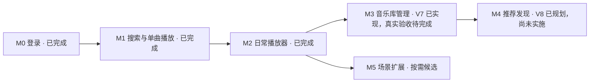

# 网易云音乐插件能力路线图

> 对象：`myavalonia-music-netease` / `myavalonia.plugin.music.netease`。更新日期：2026-09-25。
> 当前状态：V1–V4 已实现并完成手工验收，对应 M0–M2 已完成；依据为[用户验收收口记录](../archive/records/netease-v1-v4-acceptance-20260923.md)。
> M3 / V7-01～10 已实现并通过本地开发验证，当前行为见[音乐库契约](../reference/netease-music-library-management.md)，依据见[实施记录](../archive/records/netease-v7/m3-implementation-20260924.md)。真实账号与 Host 验收待完成；M4 已编写 [V8 实施计划](netease-v8-m4-music-discovery-plan.md)，尚未实施；M5 继续保留候选范围与依赖。

V 编号是实施文档序号，M 编号是能力里程碑，均不表示插件包版本或交付日期。V1–V6 历史方案统一见[归档索引](../archive/README.md)，各自验收状态单独标明；当前行为由 `reference` 维护，V5 / V6 剩余工作见[待验清单](../maintenance/netease-v5-v6-acceptance.md)。

针对现有 M0–M2 能力的体验改造，V6 的 18 项已全量接入，见 [专用修改方案](../archive/plans/netease-v6-drawer-and-interaction-change-plan.md)和[实施记录](../archive/records/netease-v6/drawer-and-interaction-implementation-20260923.md)。[原候选评估](../archive/plans/netease-v6-interaction-candidates-evaluation.md)保留取舍依据；[V5 历史复核](../archive/records/netease-v5/completion-audit-20260923.md)中的 C01–C08 已由 V6 承接，D01–D05 性能与实机待验继续保留，统一见[当前状态](../README.md#当前状态与待验范围)。V5/V6 均不表示下列 M3–M5 已启动。

## 1. 已完成基线与实际边界

| 实施编号 / 里程碑 | 已完成能力 | 当前说明与历史方案 |
| --- | --- | --- |
| V1 / M0 | 微信与网易云 App 扫码、账号核验、受保护会话、恢复及退出 | [HTTP 与会话契约](../reference/netease-http-session.md)、[V1 归档](../archive/plans/netease-v1-flurl-login-plan.md) |
| V2 / M1 | 歌曲搜索、详情、单曲播放/暂停/停止/音量，内置优先及指定 LibVLC 目录，账号设置 Tool | [播放契约](../reference/netease-music-playback.md)、[V2 归档](../archive/plans/netease-v2-m1-playback-plan.md)、[LibVLC / Dock 设计归档](../archive/plans/netease-v2-libvlc-tool-and-dock-design.md) |
| V3 / 界面改造 | 紧凑 Document / Tool、深浅主题、轻量动效与偏好 | [界面契约](../reference/netease-desktop-ui.md)、[V3 归档](../archive/plans/netease-v3-desktop-ui-and-theme-plan.md) |
| V4 / M2 | 我的歌单、共享队列、四模式、连续播放、定位、逐行/翻译/逐字歌词、本地最近播放与静默恢复 | [日常播放器](../reference/netease-daily-player.md)、[V4 归档](../archive/plans/netease-v4-m2-daily-player-plan.md) |

当前多个 Document 共用一份队列和播放器，各自独立搜索和浏览歌单。关闭任意或最后一页继续播放，重开订阅当前状态；退出账号或插件/进程关闭负责停止与释放。重启恢复队列后保持暂停，用户主动继续才取得资源并出声。此规则已替代 V2 的页面所有者停止设计。

- 当前支持 Windows x64；Linux/macOS 原生目录加载、受保护存储及 Host 适配尚未实现。
- 媒体使用 Flurl 有界完整临时缓冲；下载到本地缓冲不等于支持离线下载管理。
- 播放资源按账号返回值区分可播、试听与无地址；当前请求 standard 音质，不凭元数据承诺完整播放权限。
- 上游清单固定提交下的 440 个模块是实现参考，不等于已接入功能数量；音乐库写入子集由 V7 接入；当前仍无发现入口、Workbench Command 或 Workflow Action 注册。
- V1–V4 验收已收口；正式发布仍属独立工作，历史自动报告的证明范围不因用户验收而改变。

## 2. M3 已实施与 M4 后续主线

M3 已按 V7 专用方案实施，M4 的范围、顺序和验收要求由 V8 计划明确。新功能继续复用现有登录、队列、播放器和 UI；不以移植全部上游模块为目标。

### M3：管理自己的音乐

**开发入口：** [V7 · M3 管理自己的音乐专用实施方案](../archive/plans/netease-v7-m3-music-library-management-plan.md)。已明确 V7-01～10 范围、SOLID 职责、中文注释、页面交互、接口核对、写后回查、账号隔离及阶段交付；[V7 专用验证矩阵](../maintenance/netease-v7-m3-music-library-verification-plan.md)覆盖单元 / 协议 / UI 测试、本地门禁失败注入和人工验收。V7 业务与本地门禁已实现；最终行为和差异见[当前契约](../reference/netease-music-library-management.md)，真实验收见[H01–H05 待验记录](../archive/records/netease-v7/acceptance-20260924.md)。

**用户流程：** 听到喜欢的歌曲 → 标记喜欢 → 收藏歌单 → 建立自己的歌单并整理曲目。

| 能力 | 接口候选 | 行为要求 |
| --- | --- | --- |
| 喜欢 / 取消喜欢 | `likelist`、`like` 或核对后的同类接口 | 加载真实喜欢状态；写入后同步歌曲行与播放区 |
| 收藏 / 取消收藏歌单 | `playlist_subscribe` | 收藏状态与“我的歌单”同步，重复点击有并发控制 |
| 创建歌单、改名与描述 | `playlist_create`、`playlist_name_update`、`playlist_desc_update` | 校验输入，成功后使用服务端标识和返回结果 |
| 添加 / 移除曲目 | `playlist_tracks` 或核对后的增删接口 | 检查所有权，处理重复曲目和部分失败，更新计数与详情 |
| 删除自有歌单 | `playlist_delete` | 单独操作并明确目标；完成后同步导航与正在查看的列表 |

已交付喜欢、收藏及歌单编辑，并补充“按 ID 打开歌单”作为尚未收藏歌单的访问入口。头像、账号资料修改、批量导入和封面上传不合并进此阶段。端点按固定上游接入，令牌依赖使用官方 SDK / WebView2；真实账号返回和特殊歌单组合仍需实测，不从合成夹具外推。

**验收：** 写入后重新读取能确认实际状态；失败保留或恢复原状态；在途写入时退出账号，旧结果不能污染后续账号。超时可能意味着服务端已执行，优先查询确认，不盲目重放创建、添加或删除请求。

### M4：从“找歌听”扩展到“发现音乐”

**开发入口：** [V8 · M4 音乐发现实施计划](netease-v8-m4-music-discovery-plan.md)与[V8 专用验证矩阵](../maintenance/netease-v8-m4-music-discovery-verification-plan.md)。已明确 V8-01～10、SOLID 职责、结构化作品身份、来源 / 分页、FM 有限补取及远端反馈、账号 / 寿命、中文注释和分阶段文档交付。计划覆盖 50 个自动业务场景、6 组门禁失败注入及 6 组人工验收；代码、V8 门禁和真实验收均尚未实施。当前默认本地检查仍为 V7，不使用 AIFLOW、Windows CI 或发布门禁。

| 能力 | 接口候选 | 用户价值与边界 |
| --- | --- | --- |
| 每日推荐与推荐歌单 | `recommend_songs`、`recommend_resource`、`personalized` | 打开即可选择音乐；根据实际接口区分个性化与通用推荐 |
| 榜单 | `toplist` / `toplist_detail`，配合歌单详情 | 查看榜单并播放，复用歌单和播放器 |
| 歌手与专辑 | `artist_detail`、`artist_songs`、`artist_album`、`album` | 从歌曲进入作品页，支持分批浏览与加入队列 |
| 私人 FM | `personal_fm`、`fm_trash` | 补充连续内容；下一首与“不喜欢”区分，后者产生远端写入 |
| 远端最近播放与听歌记录 | `record_recent_song`、`user_record` | 标明数据来源与范围，不与本地历史混为同一事实 |

V8 计划顺序为推荐/榜单 → 歌手/专辑 → 私人 FM → 远端历史。所有入口复用 M2 的队列和播放服务。播放寿命的旧文案冲突与当前代码基线见[V8 前置核对](netease-v8-m4-music-discovery-plan.md#2-已核对基线与实施前差项)，实施阶段 A 需同步消除，不将 FM 作为改变关闭策略的理由。

**验收：** 推荐失效或无数据时可继续使用搜索和歌单；FM 缺数据时有限补取，不高速循环请求；账号退出后个人推荐和远端历史不残留到其他账号。

播放事件上报另立小项：只有定义了真实开始、有效时长、暂停/跳转和去重语义后，才评估 `scrobble` 等接口；本地开始播放不直接等同远端听歌统计已记录。

## 3. M5：按需求选择的扩展分支

以下均为候选，不预定全部实施。选中后必须先补专项范围、实际接口验证与验收用例。

| 分支 | 建议拆分 | 主要依赖 / 新增工作 | 建议位置 |
| --- | --- | --- | --- |
| 更丰富的音质与音频体验 | 可用音质展示 → 切换 → 更多格式 → 输出设备 / 均衡器 | M2；账号实际返回、解码格式、重取地址及设备切换验证 | 日常播放稳定后 |
| 云盘 | 列表与播放 → 上传 → 匹配 / 删除 | M2，写入复用 M3；`user_cloud*`、上传令牌与完成接口；上传事务、取消、重试、完成校验 | 有个人曲库需求时 |
| 下载与离线内容 | 单曲下载 → 任务队列 → 断点续传 → 本地管理 | M2；`song_download_url*` 的实际资格与结果；临时文件、续传、文件校验、空间和命名冲突 | 单独专项；流媒体缓冲不等于下载功能 |
| 桌面体验 | 迷你播放区 → 媒体键 / 系统媒体控制 → 桌面歌词 / 定时停止 | M2；Windows 集成、窗口和输出资源寿命、Host 可扩展范围 | 根据实际高频场景选择 |
| 工作台命令 | 播放/暂停、上一首、下一首、定位音乐页面 | M2；公开 SDK、活动文档路由、命令状态与快捷键冲突 | 播放语义稳定后，Host 联调验收 |
| Workflow Action | 查询当前播放、控制播放、将歌曲加入队列 | M2；独立选择 Provider 角色，定义取消与完成语义；只暴露稳定动作和必要数据 | 存在跨插件调用需求时 |
| 播客 / 电台 / 广播 | 分类与列表 → 节目详情 → 播放 → 订阅与续听 | M2，订阅复用 M3；`dj_*`、`voice_*` 等逐项验证，长音频位置和内容类型建模 | 单独内容产品分支 |
| MV / 视频 | 列表 → 详情 → 视频播放 | `mv_*` / `video_*`；视频解码、画面、音画同步及窗口资源 | 独立播放专项 |
| 评论与轻互动 | 先读取评论，再决定点赞/回复 | `comment_*`；分页、排序、失败反馈；写操作单独验收 | 有明确展示或互动需求时 |
| 一起听 | 房间 → 状态同步 → 队列同步 → 断线恢复 | 稳定播放器；`listentogether_*`；时钟、心跳、冲突处理 | 复杂度高，后置 |

短信/密码登录、多账号、社交动态、私信发送、数字专辑购买、会员任务、音乐人和 UGC 能力继续留在[上游清单](../reference/netease-api-enhanced-capabilities.md)，当前主线不安排。其他音源匹配也不并入网易原始播放链路，若以后选择接入，需单独表达来源与能力范围。

## 4. 进度与维护

### 现有界面的可选增强

V5 E 阶段的封面一次性取色尚未实施，保留为可选候选。若后续选择，只从小尺寸样本提取一次低饱和颜色，用于浅色静态背景，保留固定文字对比、预算与失败回退；原始取舍见 [V5 设计](../archive/plans/netease-v5-lightweight-interaction-and-ui-plan.md#72-图片与背景策略)。它不属于 V6 已批准的 18 项，也不混入必需验收。

歌词居中、队列拖动、单步撤销、Ctrl+F 与密度偏好已由 V6 实现，不再列为待开发候选。下一步验证沿用[性能与实机待验清单](../maintenance/netease-v5-v6-acceptance.md)。

### 能力里程碑

- [x] M0：登录与会话管理，用户确认手工验收完成。
- [x] M1：搜索与单曲播放、LibVLC 设置及 Host/Dock 接入，用户确认手工验收完成。
- [x] V3：紧凑桌面界面、主题与动效，用户确认手工验收完成。
- [x] M2：歌单、队列、连续播放、歌词与恢复，用户确认手工验收完成。
- [ ] M3：喜欢、收藏与歌单管理已实现并通过 V7 本地验证；真实账号 / Host / 用户总验收尚未完成。
- [ ] M4：推荐、榜单、歌手/专辑、私人 FM 与远端记录；V8 实施计划及专用验证矩阵已编写，尚未实施。
- [ ] M5：按需选择扩展分支，尚未启动。

默认本地开发检查为 V7，保留适用的 M1/V3/M2/V5/V6 回归，方法见[V7 专用验证矩阵](../maintenance/netease-v7-m3-music-library-verification-plan.md)。后续改动分别更新当前契约、快速开始、回归矩阵和专用记录；实现、自动检查和人工验收分别记录依据。

V7 本地门禁已支持并默认执行 `-Milestone V7`，46 场景及失败注入见[专用验证矩阵](../maintenance/netease-v7-m3-music-library-verification-plan.md)。不使用 AIFLOW、Windows CI 或发布门禁，正式发布另行执行。

## 5. 依据与关联文档

- [当前服务注册](../../src/MusicNetEasePlugin.Plugin/Plugin/MusicNetEasePluginServices.cs)、[模块注册](../../src/MusicNetEasePlugin.Plugin/Plugin/MusicNetEasePluginModule.cs)：当前对象图与页面入口。
- [登录契约](../../src/MusicNetEasePlugin.Plugin/Application/Authentication/AuthContracts.cs)、[登录协调器](../../src/MusicNetEasePlugin.Plugin/Application/Authentication/LoginCoordinator.cs)：已有账号能力和会话访问边界。
- [协议编码器](../../src/MusicNetEasePlugin.Plugin/Infrastructure/Http/NeteaseRequestEncoder.cs)、[传输实现](../../src/MusicNetEasePlugin.Plugin/Infrastructure/Http/NeteaseTransport.cs)：当前协议与响应约束。
- [主页面](../../src/MusicNetEasePlugin.Plugin/Features/Main/MainView.axaml)、[生命周期](../../src/MusicNetEasePlugin.Plugin/Plugin/MusicNetEasePluginLifecycle.cs)、[插件项目](../../src/MusicNetEasePlugin.Plugin/MusicNetEasePlugin.Plugin.csproj)：界面、停止行为与交付依赖。
- [HTTP 与会话契约](../reference/netease-http-session.md)、[微信登录实现与实测记录](../archive/records/netease-v1/wechat-login-implementation-20260922.md)、[本地开发验证矩阵](../maintenance/netease-login-verification.md)：当前事实及既有证据。
- [V4 实施指导](../archive/plans/netease-v4-m2-daily-player-plan.md)、[V4 专用验证](../maintenance/netease-v4-m2-daily-player-verification.md)：已完成 M2 的设计与回归依据；当前行为以参考文档为准。
- [原 V1 计划](../archive/plans/netease-v1-flurl-login-plan.md)、[固定上游能力清单](../reference/netease-api-enhanced-capabilities.md)：阶段来源与候选接口索引。其余候选沿用清单，实施前逐项核对。
- [工作台命令说明](../reference/workbench-commands.md)、[Workflow 接入说明](../reference/workflow-actions.md)：宿主集成参考，不代表音乐插件当前已注册相关能力。
